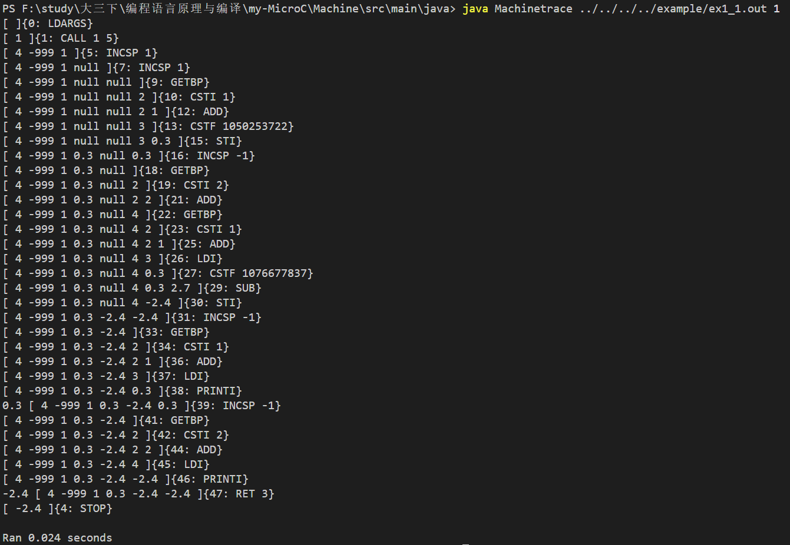
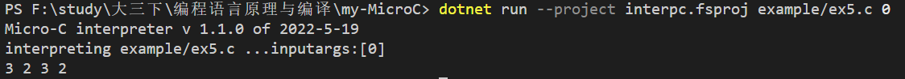

# MyMicroC

---

- 课程名称：编程语言原理与编译
- 实验项目：期末大作业
- 专业班级：计算机1903，计算机1902
- 学生学号：31902009，31903145
- 学生姓名：程志超，符佳妮
- 实验指导教师：张芸

## 简介

编译原理是计算机专业的一门重要专业课，旨在介绍编译程序构造的一般原理和基本方法。内容包括语言和文法、词法分析、语法分析、语法制导翻译、中间代码生成、存储管理、代码优化和目标代码生成。
这个编译原理的大作业，主要是在microC的基础上完成的。在对mircoc的源码阅读的过程中我们遇到了很多的困难，但经过各种文档的阅读和一些直接的试错之后还是渐渐理解了一些基本的思想。我们的想法是使microC的特性逐步增加，使其向C语言逐步靠近，在对编译原理的逐步深入了解之后，我们对于编程语言的内核也是有了更深层次的理解，慢慢理解了如何去增加一种功能。

## 文件说明

### interpreter  解释器

```sh
Absyn.fs 						                            抽象语法
CLex.fsl 								                   fslex词法定义
CPar.fsy 							                       fsyacc语法定义
Parse.fs 				                                    语法解析器
Interp.fs 												 解释器
interpc.fsproj                                               项目文件
```

### compiler  优化编译器

```sh
Absyn.fs						                           抽象语法
CLex.fsl 							                       fslex词法定义
CPar.fsy								                  fsyacc语法定义
Contcomp.fs							                	  优化编译器
Machine.fs												生成指令集定义
microcc.fsproj                                          	优化编译器项目文件
```

### java虚拟机

```sh
Type							                         类型类
Machine								                     java虚拟机
```


## 构建与执行

### 解释器

解释器 interpc.exe 构建

```sh
生成扫描器和分析器
dotnet "C:\Users\Asus\.nuget\packages\fslexyacc\10.2.0\build\fslex\netcoreapp3.1\fslex.dll"  -o "CLex.fs" --module CLex --unicode CLex.fsl

dotnet "C:\Users\Asus\.nuget\packages\fslexyacc\10.2.0\build\fsyacc\netcoreapp3.1\fsyacc.dll"  -o "CPar.fs" --module CPar CPar.fsy

# 编译解释器 interpc.exe 命令行程序 
dotnet restore  interpc.fsproj   # 可选
dotnet clean  interpc.fsproj     # 可选
dotnet build -v n interpc.fsproj # 构建./bin/Debug/net5.0/interpc.exe ，-v n查看详细生成过程

# 执行解释器
dotnet run --project interpc.fsproj example/ex1_2.c 8
dotnet run --project interpc.fsproj -g example/ex1_2.c 8  //显示token AST 等调试信息
```

### 优化编译器

优化编译器 microcc.exe 构建步骤

```sh
生成扫描器和分析器
dotnet "C:\Users\Asus\.nuget\packages\fslexyacc\10.2.0\build\fslex\netcoreapp3.1\fslex.dll"  -o "CLex.fs" --module CLex --unicode CLex.fsl

dotnet "C:\Users\Asus\.nuget\packages\fslexyacc\10.2.0\build\fsyacc\netcoreapp3.1\fsyacc.dll"  -o "CPar.fs" --module CPar CPar.fsy

dotnet restore  microcc.fsproj
dotnet clean  microcc.fsproj
dotnet build  microcc.fsproj           # 构建编译器

dotnet run --project microcc.fsproj example/ex1_2.c 0    # 执行编译器
```

### 虚拟机构建与运行

Java虚拟机的建立和运行

```sh
javac Machine.java	#生成java虚拟机
java Machine ex9.out 3	#用虚拟机运行out文件

javac Machinetrace.java
java Machinetrace ex9.out 0	#跟踪运行out文件
java Machine ../../../../example/ex1_1.out 1
java Machinetrace ../../../../example/ex1_1.out 1
```

## 功能实现

​	我们在写大作业的时候，由于解释器和编译器的实现方式略有不同，所以二者的实际运行代码会有些许的不同，我们打算之后再进行整合。

#### 编译器

- float类型的实现

  - 原本的microC并没有float类型，我们添加了这一个类型。但是在编译之后发现，原本的C#虚拟机中的stack是用int型来当做存储空间，这就不能存储我们的float类型，而且我们对C#也不熟悉，很自然的，我们就想到了是用java面向对象的特性，建立一个basetype类型的stack，在根据传入的值进行对应的子类变换，变成int型或者float型。不过在out文件中，我们还是把float类型用net自带的函数System.BitConverter.SingleToInt32Bits转换成了bits类型，方便进行生成。
  - 例子：
  
    ```C
    // (ex1_1.c)
    void main(int n) {
      float a;
      float b;
      a = 0.3;
      b = a - 2.7;
      print a;
      print b;
    }
    ```
  
   - 堆栈图：
  
     可以看到CSTF传入的是一个很大的bits数，再进行一次转换之后变成了一开始定义的float数字。
     
     

---


- 变量定义时赋值

  - 原本的microC只有变量的声明，不可在声明的时候进行赋值，我们改进了它，使其可以在声明时赋值，并且全局环境和local环境都可实现

    ```C
  // new (ex2_1.c)
    float a = 1.5;
    void main() {
    	int b = 2;
    	print a;
    	print b;
    }
    
    ```

   - 堆栈图：


- char类型的实现

  - 原本的microC并没有char类型，我们添加了这一个类型。得益于之前对于java虚拟机的改进，我们只需要新增一个baseType的charType子类。就可以继续用改进之后的java虚拟机进行out文件的执行和输出。同样的，在储存形式上我们也使用net自带的(int32)（System.BitConverter.ToInt16((System.BitConverter.GetBytes(char(i))),0)）函数对char进行转换，方便存储。
  - 例子：
  
    ```C
    // (ex3_1.c)
    void main(int n) { 
    	char a= 'aaa';
    	print a;
    	print 'S';
    }
    
    ```
  
   - 堆栈图：
  
     在这里CSTC直接存入了a，不过在out文件中还是以ASCII码的形式进行存储。如97对应a。
     
     

---

- 三目运算符（a?b:c）的实现

  - 原本的microC并没有三目运算符。只有单目和双目运算符，我们增加了三目运算符这一特性进行运算。
  - 例子：
  
    ```C
    // (ex4.c)
    void main(int n) { 
    	int a = 1;
    	int b = 2;
    	b = a ? 1 : 0;
    	print b;
    }
    ```
  
   - 堆栈图：
  
     

---

- 自增自减的实现

  - 由于是即时解释运行，所以i++和++i没有不同，都是先加给自身在进行其他操作。自减操作同理。
  - 例子：
  
    ```C
    // (ex5.c)
    void main(int n) {
    	int a = 2;
    	int n = a++;
    	print n;
    	n = a--;
    	print n;
    	n = ++a;
    	print n;
    	n = --a;
    	print n;
    }
    ```
  
   - 堆栈图：
  
     
     
     
     
     
     

---

- switch-case的实现

  - 原本的microC并没有实现switch-case，我们实现了switch-case，同时也增加了break，使其和C语言中的switch-case基本一致，且default的位置也没有固定在末尾。不过由于我们switch的逻辑是对case进行依次匹配，若满足case的条件则运行case中的语句，而我们编写的default则是一种另类的case，是无论条件如何都会满足的case，所以一旦放在首位，则会率先运行default，这一点和C语言中有所不同。
  - 例子：
  
    ```C
    // (ex6_1.c)
    void main(int n) {
    	switch (n){
    		case 1: {
    			print 'a';
    			break;
    		}
    		case 2: {
    			print 'b';
    		}
    		case 3: {
    			print 'c';
    			break;
    		}
    		default: {
    			print 's';
    			break;
    		}
    	}
    }
    ```
  
   - 堆栈图：
  
     
     

---

- for循环的实现

  - 原本的microC并没有for循环，但是有while循环，所以实现for循环也比较容易。
  - 例子：
  
    ```C
    // new (ex7_1.c)
    void main() {
        int i;
        i = 0;
        for (i = 0; i < 3; i++) {
            print i;
        }
        print 'S';
    }
    ```
  
   - 堆栈图：
  
     
     
     
     

---
- continue，break的实现

  - 原本的microC并没有continue和break，我们增加了continue和break，同时break在switch中也有所介绍，因为逻辑都是一样，都只是跳出运行的语句块，所以可以一起使用。
  
  - 例子：
  
    ```C
    // new (ex8.c)
    void main() {
    	int i;
    	for (i = 1; i <= 5; i++) {
    		if (i % 2 == 0) {
    			continue;
    		}
    		print i;
    	}
    	print 'S';
    	for (i = 1; i <= 10; i++) {
    		if (i == 2) {
    			break;
    		}
    		print i;
    	}
    }
    ```
  
   - 堆栈图：
  
     由于for循环的堆栈较多，就不全部展示了，下面是continue语句的堆栈，可以看到当判断完之后没有运行print，而是直接跳转到了for语句的开头开始下一次的循环。
     
     
     
     
     
     

---
- dowhile循环的实现

  - 原本的microC并没有dowhile循环，但是有while循环，所以实现dowhile循环也很容易，比for循环的实现更加简便。
  - 例子：
  
    ```C
    // new (ex9.c)
    void main(int i) {
    	do {
    		print i;
    		i++;
    	} while (i <= 3);
    	printc 'S';
    }
    ```
    
   - 堆栈图：
  
     
     

---
- try-catch的实现

  - 原本的microC并没有try-catch，try-catch的特性比较的高级，也比较的困难，在添加这一部分特性的时候遇到了许多的困难。一开始用labellist进行跳转的想法难以实现，后面还是借鉴了cuby的实现方式，采用了增加两个命令，push和pop到机器码的层面，才能比较完好的实现。通过这两个命令，当异常出现时依次在push的结点进行检查，如果满足则进行语句的执行，也就是异常被catch到了，但是总体还是较难，所以还是只实现了一个异常，也就是除数为0的异常检查，并进行catch。
  - 例子：
  
    ```C
    // new (ex10.c)
    void main(int n) {
        try {
            int a = 0;
            int n = 5;
            n = n / a;
        }
        catch ("ArithmeticalExcption")
        {
            n = 0;
            print n;
        }
    }
    ```
  
   - 堆栈图：
  
     
     
     可以看到，在除数为0之后出现了报错，然后被catch捕获并提示是在哪里捕捉，其中3为catch的地址，hr为用push和pop单独维护的一个每个catch的栈的地址。

---
- finally的实现

  - 原本的microC并没有finally，用于借鉴的cuby中也仅有try-catch并没有finally的实现过程，我在阅读之后发现，读取catch的逻辑和switch中读取case的逻辑基本一致，当时我在添加default的时候也是把default当做一个另类的case，所以现在我就把finally包装成了一个另类的catch，并且在fianlly之后强制程序结束，用于贴近java中的trycatch机制。而且由于finally一定会在catch之后出现，所以我在switchcase中default的窘境在这里反而成为了一个契合的特点。
  - 例子：
  
    ```C
    // new (ex11.c)
    void main(int n) {
        try {
            int a = 0;
            int n = 5;
            n = n / a;
        }
        catch ("ArithmeticalExcption")
        {
            n = 0;
            print n;
        }
        finally {
            print 'F';
        }
        print 'S';
    }
    ```
  
   - 堆栈图：
  
     
     
     在异常出现的时候会进行异常的提示，然后再去运行异常内部的语句，而进行提示的时候，也是把hr指针从异常栈底移到栈顶的过程，所以先报出来的是finally错误（为了说明，可以隐去），然后则是他自己的错误，即hr为1的错误，当移到栈顶之后，则进行依次遍历，如同switch中寻找case一样，依次配对，运行，不过在finally的末尾我增加了一个stop命令，强制终止这个程序所以k并没有被打印出来。

---
- and，or，xor的实现

  - 原本的microC有&&和||但这个是顺序与和顺序或，和一般的与和或逻辑不一致，所以我新增了三个符号“&&&”，“|||”和“|&|”，分别表示与，或，异或
  - 例子：
  
    ```C
    // new (ex12.c)
    int main() {
    	int a;
    	a = 3 &&& 2;
    	print a;
    	a = 1 ||| 0;
    	print a;
    	a = 1 |&| 1;
    	print a;
    }
    ```
    
   - 堆栈图：
  
     
---

#### 解释器

由于解释器和编译器的实现逻辑有所不同，所以在编译器中实现的功能有些在解释器中尚未实现，并且有些地方有少许出入。需要之后进行改进。

- float类型的实现

  - 由于解释器中需要即时输出，所以不能使用java的子类继承的方法进行实现，经过查询微软的net文档之后，可以用类型转换直接实现，同样的要考虑到即时的类型判断，所以我在这里添加了一个printf，通过输入的符号进行类型判断。
  - 例子：
  
    ```C
    // (ex1_2.c)
    void main(int n) {
      float a;
      a = 1.5;
      printf("%f",a);
    }
    ```
    
   - 输出：
  
     

---


- 变量定义时赋值

  - 没有实现全局变量的定义时赋值，有点缺陷。

  - 例子：

    ```C
    // old
    int a;
    a = 3;
    int main(){
        print a;
    } 
    ```

    ```C
    // new (ex2_2.c)
    void main() {
    	float a = 1.5;
    	int b = 2;
    	printf("%f", a);
    	printf("%d", b);
    }
    ```
    
   - 输出：


- char类型的实现

  - 和编译器一直，print语句有所不同。
  - 例子：
  
    ```C
    // (ex3_2.c)
    void main() { 
    	char a= 'a';
    	printf("%c",a);
    	printf("%c",'S');
    }
    ```
  
   - 输出：
  
     由于是即时输出，所以很简洁。
     
     

---

- 三目运算符（a?b:c）的实现

  - 和编译器一致
  - 例子：
  
    ```C
    // (ex4.c)
    void main(int n) { 
    	int a = 1;
    	int b = 2;
    	b = a ? 1 : 0;
    	print b;
    }
    ```
  
   - 输出：
  
     
---

- 自增自减的实现

  - 原本的microC并没有自增和自减，我们添加了这一操作，同时包含了++i,--i,i++,i--这四个。
  
  - 例子：
  
    ```C
    // (ex5.c)
    void main(int n) {
    	int a = 2;
    	int n = a++;
    	print n;
    	n = a--;
    	print n;
    	n = ++a;
    	print n;
    	n = --a;
    	print n;
    }
    ```
  
   - 输出：
  
     
     
---

- switch-case的实现

  - 解释器中的switch-case和编译器中的switch有比较大的不同，由于解释器这边是即时的环境存储，所以没有如编译器中用labellist串起所有的case，而是相当于自带break一般直接跳出switch。
  - 例子：
  
    ```C
    // (ex6_2.c)
    void main(int n) {
    	switch (n){
    		case 1: {
    			printf("%c" ,'a');
    		}
    		case 2: {
    			printf("%c", 'b');
    		}
    		case 3: {
    			printf("%c", 'c');
    		}
    		default: {
    			printf("%c", 'S');
    		}
    	}
    }
    ```
    
   - 输出：
  
     
---

- for循环的实现

  - 和编译器一致
  - 例子：
  
    ```C
    // new (ex7_2.c)
    void main() {
        int i;
        i = 0;
        for (i = 0; i < 10; i++) {
            print i;
        }
        print 'N';
    }
    ```
  
   - 输出：
  
     

---
- continue，break未在解释器中实现


由于我们没有再解释器中实现labellist用于建立和维护label，所以我们没有实现break和continue，暂且不表。

---
- dowhile循环的实现

  - 和编译器一致
  - 例子：
  
    ```C
    // new (ex9.c)
    void main(int i) {
    	do {
    		print i;
    		i++;
    	} while (i <= 10);
    	printc 'S';
    }
    
    ```
  
   - 输出：
  
     

---
- try-catch和finally的实现


同样由于确实labellist 的原因，我们也没有在解释器中实现trycatch相关的特性。

---
- and，or，xor的实现

  - 和编译器中一致
  - 例子：
  
    ```C
    // new (ex12.c)
    int main() {
    	int a;
    	a = 3 &&& 2;
    	print a;
    	a = 1 ||| 0;
    	print a;
    	a = 1 |&| 1;
    	print a;
    }
    
    ```
  
   - 输出：
  
     
---
#### 虚拟机

- 介绍：

  由于使用比较普遍的C#虚拟机中的栈是用int数组作为储存的，当我在添加float类型时遇到了储存和输出的困难，但是我们不太出席C#，java作为一种比较熟悉的语言，而它面向对象的特性也能完美发挥，通过类型继承来使得各个类型之间的转换。

- 类的继承关系：

  BaseType是父类，

  IntType，FloatType，CharType都是BaseType的子类。

- 指令集添加：

  - CSTF =26：

    在堆栈中增加一个float型的数据

  - CSTC =27：

    在堆栈中增加一个char型的数据

  - THROW = 28：

    抛出异常

  - PUSHHR = 29：

    保存catch中的异常种类，需要跳转的地址并让hr新增的这个寄存器入栈

  - POPHR = 30：

    出栈，与PUSHHR相对应

  - AND =31：

    与运算

  - OR=32：

    或运算

  - XOR=33：

    异或运算

- 增加的try-catch：

  目前只有一个除0时的异常捕获。同时用字符串的方式来进行异常的匹配。当有异常发生的时候，hr从栈底遍历到栈顶，依次进行配对，用于提示异常类型。这样重新到了栈顶，再次进行匹配，被catch捕捉之后再运行对应的语句。而finally由于在最后的位置，所以一定是运行完catch之后才会轮到finally，同时我在finally之中增加了stop指令，和java中的try-catch一致。

## 心得体会

- 程志超： 

  编译原理对于我来说真的是一门非常具有挑战性的课程，除了抽象语法树、词法、语法、语义分析这种概念比较陌生之外，还涉及到比较多计算机底层的原理，说实话一开始接触这门课的时候有一种望而生畏的感觉。

  随着课程的进行还接触到了F# 语言，发现它和我之前接触过JavaScript以及它的超集TypeScript语言有很多相似之处，语法虽然有点复杂，不过花上时间还是能理解的

  大作业的难度还是挺大，需要有比较强的综合能力，一方面需要对抽象语法树、词法、语法、语义分析这种概念理解透彻，另一方面还要学会改写应用F# 以及java语言完善一个编程语言的编译器，解释器，虚拟机。一开始毫无头绪，只能看着示例的microC代码推测每个代码的作用，后来慢慢理解了，逐步改写，实现一部分功能。总之，通过大作业，让我对编译原理这门课有了更深的理解，对计算机底层有了更深的理解。

- 符佳妮：  

  这门课对计算机专业同学来说十分的重要，但课程难度总体偏大。开始的理论知识懵懵懂懂的听着，到了课程中后期，与编程实践联系起来，才逐渐明白实现编程语言的步骤。这个对于编程中的计算思维，我们写其他编程时候的设计都是十分有帮助的。
  在完成大作业的过程中，我对于编译原理有了更深的认识，从刚开始学习F#语言到使用F#对microc进行改进，学习到了许多新的东西，对各种编程语言也有了一个大概的了解。
  大作业完成中，对指令与栈结构还有语法分析等等编译原理的基本知识有了更深的了解，也认识到了这其中值得学习的地方。
  随着对F#的使用，也加深了对函数式编程语言的理解，之前对于C语言的简单学习并不支持F#的使用，需要有更深的理解。不过C语言的学习也帮助我能够看懂F#的代码。能够进行更深的学习。
  在大作业有些功能的完成上，有些还没有完全理解，需要更进一步的学习。


## 技术评价

| 功能            | 对应文件 | 优   | 良   | 中   |
| --------------- | -------- | ---- | ---- | ---- |
| float类型       | ex1_1.c  | √    |      |      |
| 变量声明时赋值  | ex2_1.c  | √    |      |      |
| char类型        | ex3_1.c  | √    |      |      |
| 三目运算符      | ex4.c    | √    |      |      |
| 自增自减        | ex5.c    | √    |      |      |
| switch-case     | ex6_1.c  |      | √    |      |
| for循环         | ex7_1.c  | √    |      |      |
| break和continue | ex8.c    | √    |      |      |
| do-while循环    | ex9.c    | √    |      |      |
| try-catch       | ex10.c   |      | √    |      |
| finally         | ex11.c   | √    |      |      |
| 逻辑运算符      | ex12.c   | √    |      |      |


## 小组分工

- 程志超
  - 学号：31902009
  - 班级：计算机1903
    - 工作内容
      - 测试程序
      - float，char的定义
      - 虚拟机改进
      - break continue的实现
      - try-catch实现
      - finally
      - 解释器中代码的增加
- 符佳妮
  - 学号：31903145
  - 班级：计算机1902
    - 工作内容
      - 文档编写
      - 实现定义变量时赋值
      - 三目运算符，自增自减实现
      - for，do-while循环实现
      - switch break的实现
      - 逻辑符号实现
  
- 权重分配表：  

| 沈科迪 | 林承毅 |
| ------ | ------ |
| 0.95   | 0.95   |
